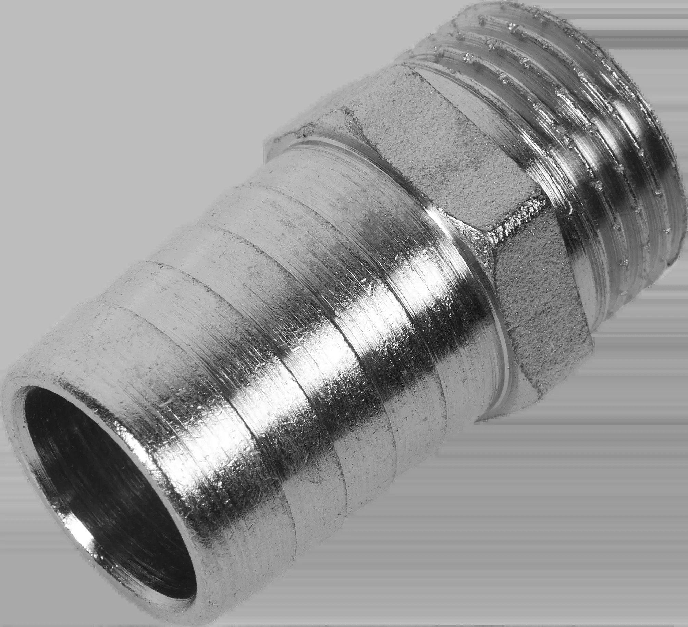
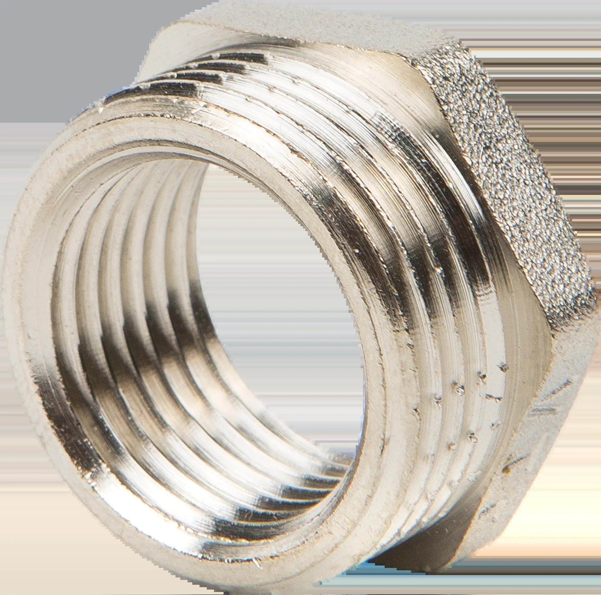
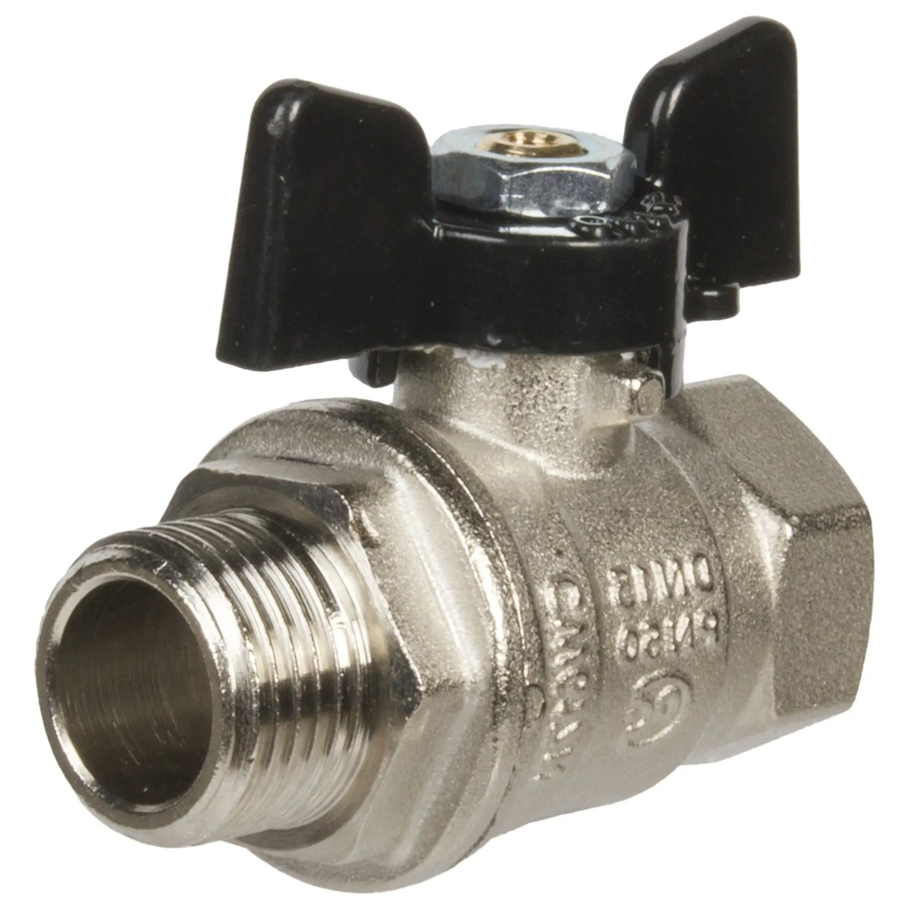
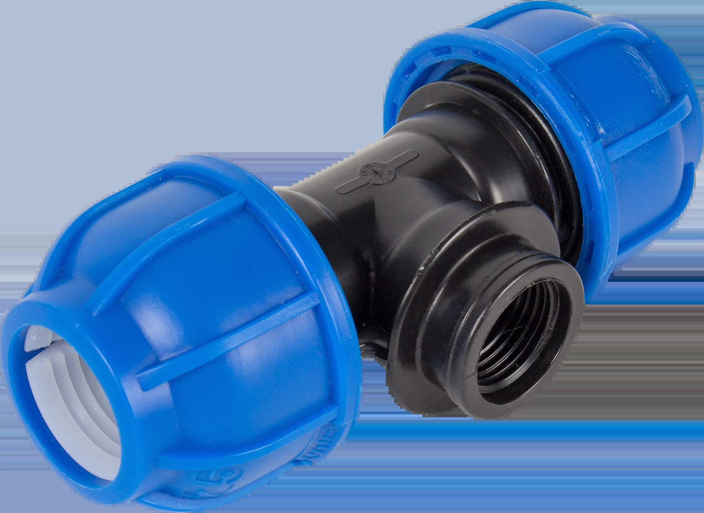
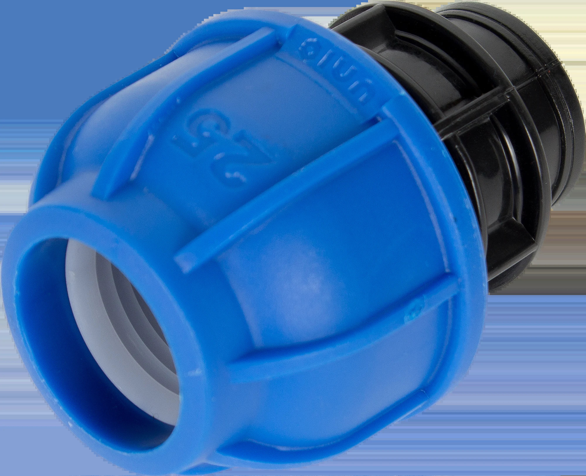

## Купить

* 3 штуки - Штуцер Valtec, для присоединения шланга, наружняя резьба, 20 мм х 1/2", никелированная латунь

    

    https://chelyabinsk.leroymerlin.ru/product/shtucer-valtec-11697202/

* 2 штуки - Футорка Valtec, наружная-внутренняя резьба, 3/4"x1/2" мм, никелированная латунь

    

    https://chelyabinsk.leroymerlin.ru/product/futorka-valtec-10511656/

* 1 штука - Муфта переходная Valtec, внутренняя-внутренняя резьба, 1"х3/4", никелированная латунь

    

    https://chelyabinsk.leroymerlin.ru/product/mufta-perehodnaya-valtec-10508529/

* 2 штуки - Кран шаровый Bugatti 1/2", внутренняя-наружная резьба

    

    https://chelyabinsk.leroymerlin.ru/product/kran-sharovyy-bugatti-12-82042011/

* 1 штука - Тройник, внутренняя резьба, 1/2"х25х25 мм, полиэтилен

    

    https://chelyabinsk.leroymerlin.ru/product/troynik-82149025/

* 2 штуки - Муфта переходная, внутренняя резьба, 1/2"х25 мм, полиэтилен

    

    https://chelyabinsk.leroymerlin.ru/product/mufta-perehodnaya-82149002/

* 1 штука - Шланг для полива 3/4 дюйма

    У шланга 3/4 внутренний диаметр будет около 19мм и мне нужен именно такой (должен подходить к штуцерам).
    Я его буду резать, так что сильно длинный (больше 5 метров) не нужен.

    https://chelyabinsk.leroymerlin.ru/product/shlang-dlya-poliva-34-dyuyma-82188935/#nav-reviews
